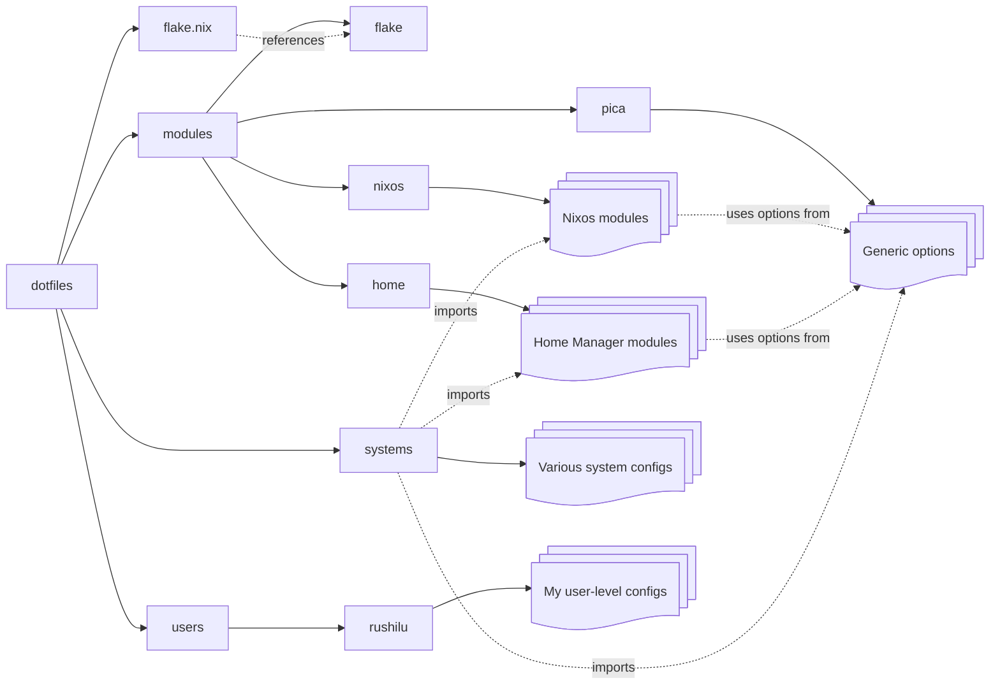

# PistachioCake's system configurations

Based loosely off of [isabel roses's dotfiles](https://github.com/isabelroses/dotfiles), using her [easy-hosts](https://github.com/tgirlcloud/easy-hosts) tool.

## Directory structure

The `modules/pica` directory, and the `pica` namespace, provides generic options that we can hook into in other places. These reference *my* specific configurations that fulfill my usecases; they will not work for other people.
